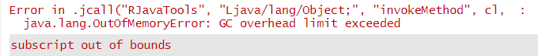

```{r setup, include = FALSE}

options(htmltools.dir.version = FALSE)
# knitr::opts_chunk$set(echo = FALSE, warning = FALSE, message = FALSE, comment = "")
knitr::opts_chunk$set(echo = TRUE, comment = "")

library(knitr)
library(tidyverse)
library(bench)
theme_set(theme_gray(base_size = 17))

```

# Packages

.pull-left[
Package | Author(s)
--------|------------------------
XLConnect | Martin Studer et al. (Mirai Solutions)
xlsx | Cole Arendt et al.
openxlsx | Philipp Schauberger et al.
writexl | Jeroen Ooms (ROpenSci)
rio | Thomas J. Leeper et al.
readxl | Hadley Wickham, Jenny Bryan et al.
gdata | Gabor Grothendieck et al.
]

.pull-right[
.pull-left[
```{r, out.width = "150px", out.height = "150px", fig.align = "center", echo = FALSE}
knitr::include_graphics("libs/_Images/logo_XLConnect.png")
```

```{r, out.width = "150px", out.height = "150px", fig.align = "center", echo = FALSE}
knitr::include_graphics("libs/_Images/logo_rio.png")
```
]
.pull-right[
```{r, out.width = "150px", out.height = "150px", fig.align = "center", echo = FALSE}
knitr::include_graphics("libs/_Images/logo_openxlsx.png")
```

```{r, out.width = "150px", out.height = "150px", fig.align = "center", echo = FALSE}
knitr::include_graphics("libs/_Images/logo_readxl.png")
```
]

]
---

# Data: 1,000 / 10,000 / 100,000 Rows

```{r data}

library(tidyverse)
set.seed(2021)

data_sim <- function(n) {
  data.frame(replicate(3, rnorm(mean = 100, sd = 15, n = n)),
             replicate(3, sample(letters, size = n, replace = TRUE))
            )
}

data_small <- data_sim(n = 1000)
glimpse(data_small)

data_medium <- data_sim(n = 10000)
data_large <- data_sim(n = 100000)

```

---

# Exporting the Data in Excel Format

## Define functions for flexible packages

```{r save}

XLConn_fn <- function(data) {
  data_chr <- deparse(substitute(data))
  wb <- XLConnect::loadWorkbook(paste0(data_chr, "_XLConnect_fn.xlsx"), create = TRUE)
  XLConnect::createSheet(wb, name = data_chr)
  XLConnect::writeWorksheet(wb, data, sheet = data_chr)
  XLConnect::saveWorkbook(wb)
}

xlsx_fn <- function(data) {
  data_chr <- deparse(substitute(data))
  wb <- xlsx::createWorkbook()
  sh <- xlsx::createSheet(wb, sheetName = data_chr)
  xlsx::addDataFrame(x = data, sheet = sh)
  xlsx::saveWorkbook(wb, file = paste0(data_chr, "_xlsx_fn_.xlsx"))
  
}
```

---

# Export to Excel: 1,000 Rows

.pull-left[
```{r bench-function}

my_benchmark <- function(data) {
  bench::mark(
    XLConnect_fun = XLConn_fn(data),
    XLConnect = XLConnect::writeWorksheetToFile(
                data = data,
                file = "data_small_XLConnect.xlsx",
                sheet = "data_small"),
    xlsx_fun = xlsx_fn(data),
    xlsx = xlsx::write.xlsx(data,
                file = "data_small_xslx.xlsx"),
    openxlsx = openxlsx::write.xlsx(x = data,
                file = "data_small_openxlsx.xlsx",
                overwrite = TRUE),
    rio = rio::export(data,
                file = "data_small_rio.xlsx", 
                overwrite = TRUE),
    writexl = writexl::write_xlsx(data, #<<
                path = "data_small_writexl.xlsx"), #<<
    check = FALSE, relative = TRUE
  ) 
}

```

```{r bench-function-no-java, echo = FALSE}

my_benchmark2 <- function(data, size) {
  bench::mark(
    openxlsx = openxlsx::write.xlsx(
                x = data,
                file = paste0("data_", size, "_openxlsx.xlsx"),
                overwrite = TRUE),
    rio = rio::export(data,
                file = paste0("data_", size, "_rio.xlsx"),
                overwrite = TRUE),
    writexl = writexl::write_xlsx(data,
                path = paste0("data_", size, "_writexl.xlsx")),
    check = FALSE,
    relative = TRUE
  ) 
}

```
]

.pull-right[

```{r small-plot, warning = FALSE, out.height = "400px", cache = TRUE}

small <- my_benchmark(data_small)

autoplot(small, type = "boxplot") +
  ggtitle("1,000 Rows")

```
]

---

# Export to Excel: Larger Data

With larger data, you can quickly run into Java errors ...

```{r java-error, eval = FALSE}
medium <- my_benchmark(data_medium)
large <- my_benchmark(data_large)
```



* Avoid Java-based packages **XLConnect** and **xlsx**
* Focus on **writexl**, **openxlsx** and **rio**

---

# Export to Excel: Larger Data

```{r medium-large, warning = FALSE, cache = TRUE}

medium <- my_benchmark2(data_medium, "medium")
large <- my_benchmark2(data_large, "large")

```

.pull-left[
```{r medium-plot, warning = FALSE, out.height = "350px", cache = TRUE}

autoplot(medium,  type = "boxplot") +
  ggtitle("10,000 Rows")

```
]

.pull-right[
```{r large-plot, warning = FALSE, out.height = "350px", cache = TRUE}
autoplot(large, type = "boxplot") +
  ggtitle("100,000 Rows")

```
]

---

# Importing Excel Data: 1,000 Rows

**xlsx** gave me more Java errors, so I leave that out.

```{r import-small, cache = TRUE}

small <- bench::mark(
    XLConnect = {
      wb <- XLConnect::loadWorkbook(file = "data_small_rio.xlsx")
      XLConnect::readWorksheet(wb, sheet = "Sheet 1")
    },
    openxlsx = openxlsx::read.xlsx("data_small_rio.xlsx"),
    rio = rio::import("data_small_rio.xlsx"), #<<
    readxl = readxl::read_excel("data_small_rio.xlsx"), #<<
    check = FALSE, relative = TRUE
)
```

---

# Importing Excel Data: 1,000 Rows

```{r import-small2, out.height = "400px", fig.align = "center", cache = TRUE}

autoplot(small, type = "boxplot") +
  ggtitle("1,000 Rows")

```

---

# Importing Excel Data: Larger Data

```{r import-larger, cache = TRUE, echo = FALSE, warning = FALSE}

medium <- bench::mark(
    XLConnect = {
      wb <- XLConnect::loadWorkbook(file = "data_medium_rio.xlsx")
      XLConnect::readWorksheet(wb, sheet = "Sheet 1")
    },
    openxlsx = openxlsx::read.xlsx("data_medium_rio.xlsx"),
    rio = rio::import("data_medium_rio.xlsx"),
    readxl = readxl::read_excel("data_medium_rio.xlsx"),
    check = FALSE, relative = TRUE
)

large <- bench::mark(
    openxlsx = openxlsx::read.xlsx("data_large_rio.xlsx"),
    rio = rio::import("data_large_rio.xlsx"),
    readxl = readxl::read_excel("data_large_rio.xlsx"),
    check = FALSE, relative = TRUE
)

```

.pull-left[
```{r medium-plot2, out.height = "375px", cache = TRUE}

autoplot(medium, type = "boxplot") +
  ggtitle("10,000 Rows")

```
]

.pull-right[
```{r large-plot2, out.height = "375px", cache = TRUE}

autoplot(large, type = "boxplot") +
  labs(title = "100,000 Rows",
       caption = "No XLConnect to avoid Java errors")

```
]

```{r cleanup, echo = FALSE}

try(unlink("data_*.xlsx", expand = TRUE, force = TRUE))

```

---

# Summary

## Data Import

* Avoid Java dependency
* **readxl** wins
* You may like **rio** for convenience (same function for different file types)

## Data Export

* Avoid Java dependency
* **writexl** is fastest
* **openxlsx** is very flexible (e. g. apply formatting to Excel sheets)

---

class: center, middle

# Thanks!

### Youtube: StatistikinDD

### Twitter: @StatistikinDD

### github: fjodor

Slides created via the R package [**xaringan**](https://github.com/yihui/xaringan).

The chakra comes from [remark.js](https://remarkjs.com), [**knitr**](https://yihui.org/knitr), and [R Markdown](https://rmarkdown.rstudio.com).

Thanks to **Yihui Xie** for *{knitr}* and *{xaringan}* and **Garrick Aden-Buie** for *{xaringanthemer}*.