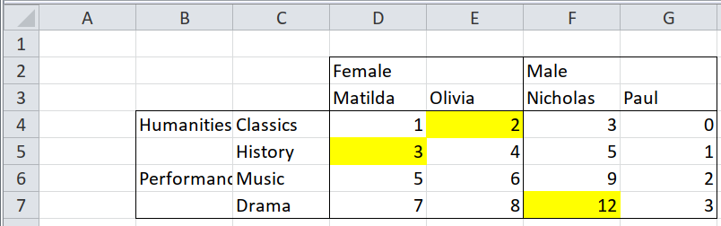

```{r setup, include = FALSE}

options(htmltools.dir.version = FALSE)
# knitr::opts_chunk$set(echo = FALSE, warning = FALSE, message = FALSE, comment = "")
knitr::opts_chunk$set(echo = TRUE, comment = "")

library(knitr)
library(tidyverse)
library(unpivotr)
library(tidyxl)

```

# The Challenge: Importing Pivoted<br>Excel Data



--

## The Solution: Spreadsheet Munging Strategies

* Book by **Duncan Garmonsway** ***@nacnudus***; see chapters 3.1.2 and 3.1.3
* Available online for free at https://nacnudus.github.io/spreadsheet-munging-strategies/index.html

---

# What Would a Tidy Data Frame of this Data look like?

.pull-left[

]

--

.pull-right[
```{r tidy-data, echo = FALSE}

path <- system.file("extdata", "worked-examples.xlsx", package = "unpivotr")

xlsx_cells(path, sheets = "pivot-annotations") %>%
  dplyr::filter(!is_blank) %>%
  select(row, col, data_type, character, numeric) %>% 
  behead("up-left", sex) %>%
  behead("up", `name`) %>%
  behead("left-up", field) %>%
  behead("left", subject) %>%
  rename(score = numeric) %>%
  select(-data_type, -row, -col, -character) %>% 
  head() %>% 
  kable()

```

Each header level is a variable

]

Let's break it down, step by step ...

---

# Step 1: Read Data into R<br>tidyxl::xlsx_cells()

```{r read-data}

library(tidyverse)
library(unpivotr)
library(tidyxl)

path <- system.file("extdata", "worked-examples.xlsx", package = "unpivotr")

all_cells <- tidyxl::xlsx_cells(path, sheets = "pivot-annotations") #<<
```

```{r, echo = FALSE}
all_cells %>% 
  select(sheet, address, row, col, data_type, numeric, character, local_format_id) %>% 
  head(n = 4) %>% kable()
```

### Each **Excel cell** is represented by **one row** in R

---

# Step 2 (optional): Peek at <br>Original Format - unpivotr::rectify()

```{r rectify}

unpivotr::rectify(all_cells) %>% #<<
  kable()

```

---

# Step 3: Filter Non-blank Rows,<br>Select Variables

.pull-left[
```{r filter-select}

all_cells <- all_cells %>% 
  dplyr::filter(!is_blank) %>%  #<<
  select(row, col, data_type, character, numeric)

```

* Column "character" contains several header levels
* Column "numeric" contains data values

]

.pull-right[
```{r, echo = FALSE}

all_cells %>% slice(3:12) %>% kable()

```

]

---

# Step 4: Turn "Character" Entries<br>Into Headers, Level by Level

.pull-left[

## unpivotr::behead()

```{r behead, eval = FALSE}

all_cells %>% 
  behead("up-left", sex) %>% #<<
  behead("up", `name`) %>% #<<
  behead("left-up", field) %>% #<<
  behead("left", subject) %>% #<<
  rename(score = numeric) %>%
  select(-data_type, -row, -col, -character)

```
]

.pull-right[
```{r, ref.label = "behead", echo = FALSE, eval = TRUE}
```

]

---

# Step 5: Process Cell Formattings<br> using *local_format_id* Column

### tidyxl::xlsx_formats()

* Use same code as before, but keep *row* and *col* variables
* Store result in ***unpivoted***

```{r, echo = FALSE}

unpivoted <- all_cells %>% 
  behead("up-left", sex) %>% #<<
  behead("up", `name`) %>% #<<
  behead("left-up", field) %>% #<<
  behead("left", subject) %>% #<<
  rename(score = numeric) %>%
  select(-data_type, -character)

```

```{r formattings}
# Obtain info on fill colours
fill_colours <- xlsx_formats(path)$local$fill$patternFill$fgColor$rgb #<<

# Create second data frame: annotations
annotations <- xlsx_cells(path, sheets = "pivot-annotations") %>% 
  dplyr::filter(row >=4, col >=4) %>%  # omit headers
  mutate(fill_colour = fill_colours[local_format_id]) %>%  #<<
  select(row, col, fill_colour)

# Join data sets
data <- left_join(unpivoted, annotations, by = c("row", "col")) %>%  #<<
  select(-row, -col)
```

---

# Step 5: What does the Final Result<br>Look Like?

```{r final}

data %>% slice(c(1:4, 12:16)) %>% kable()

```

---

# Overview of R Packages and Functions

Package | Function | Description
----------|----------|------------
tidyxl | xlsx_cells()| Imports from spreadsheets: each cell represented by a row in a data frame;<br>Gives address, contents, formula, and formatting info
tidyxl | xlsx_formats() | Returns cell formatting in identically structured sublists<br>*style: *Excel's built-in styles like "normal", "good", headers, etc.<br>*local:* overrides *style*
unpivotr | as_cells()| Imports from spreadsheets or HTML, returns row and column, content, data type
unpivotr | rectify() | Takes object from *as_cells()* or *xlsx_cells()* and projects cells in original positions<br>Default: prints to console; parameter *display:* "browser" or "rstudio" (viewer pane)
unpivotr | behead() | Takes one level of headers from a pivot table and makes it part of the data<br>Similar to *tidyr::pivot_longer()*, but works when there is more than one row of headers; works only on output of *as_cells()* or *xlsx_cells()*<br>For more flexibility, see also *enhead()*
unpivotr | spatter() | Similar to *tidyr::pivot_wider()*, but for different columns with different data types<br>Works on output of *as_cells()* or *xlsx_cells()*

---

# Comparing tidyxl, readxl and unpivotr

## tidyxl vs. readxl

#### "tidyxl is more general, and less magic"

## tidyxl vs. unpivotr

* **tidyxl** imports a lot of information from Excel (content, position, formatting)
* **tidyxl** leaves it to the user to re-encode this information without loss
* **unpivotr** assists the user in the re-encoding step

## Alternative: unheadr

* *annotate_mf()* function shows Excel formattings
* See https://luisdva.github.io/rstats/unheadr-cat/

---

class: center, middle

# Thanks!

### Youtube: StatistikinDD

### Twitter: @StatistikinDD

### github: fjodor

Slides created via the R package [**xaringan**](https://github.com/yihui/xaringan).

The chakra comes from [remark.js](https://remarkjs.com), [**knitr**](https://yihui.org/knitr), and [R Markdown](https://rmarkdown.rstudio.com).

Thanks to **Yihui Xie** for *{knitr}* and *{xaringan}* and **Garrick Aden-Buie** for *{xaringanthemer}*.