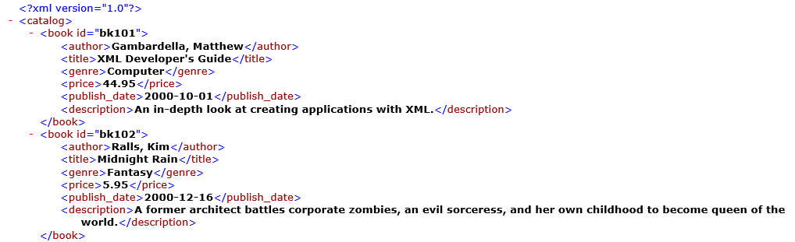

```{r setup, include = FALSE}

options(htmltools.dir.version = FALSE)
# knitr::opts_chunk$set(echo = FALSE, warning = FALSE, message = FALSE, comment = "")
knitr::opts_chunk$set(echo = TRUE, comment = "")

library(knitr)
library(tidyverse)
library(bench)
theme_set(theme_gray(base_size = 17))

```

# The XML Package

### Author: Duncan Temple Lang
### Contributor: Tomas Kalibera
### Maintainer: CRAN Team

### License: BSD_3_clause

### Copyright Holder:

#### Duncan Temple Lang, Bell Labs, Lucent Technologies, University of California, Davis
#### CRAN Team 

---

# What XML Data Looks Like



Source: books.xlm, Microsoft Docs, Microsoft XML Core Services (MSXML) SDK
--

* XML = E**X**tensible **M**arkup **L**anguage
* XML defines a set of rules for encoding documents in a format   
both *human-readable* and *machine-readable*

---

# Importing xml Data in One Step

```{r xmlimport-onestep}
library(XML)
books <- xmlToDataFrame("xml-data.xml") #<<
```

--

```{r xmlimport-onestep2}
books |> DT::datatable(options = list(pageLength = 2))
```

---

# Importing xml Data, Step by Step

### xmlTreeParse(): Parse XML file; R Structure to Represent XML Tree

```{r xmlTreeParse}

xmlimport <- xmlTreeParse("xml-data.xml") #<<
class(xmlimport)
str(xmlimport, max.level = 3)

```

---

# Importing xml Data, Step by Step

### xmlTreeParse(); R Structure to Represent XML Tree

Data are not very convenient to work with in this nested list format ...

This is how we can extract the second book in Base R:

```{r}

xmlimport$doc$children$catalog$children[[2]] #<<

```

---

# Importing xml Data, Step by Step

### xmlRoot(): Access the root / top-level XML node

```{r}

topxml <- xmlRoot(xmlimport) #<<
str(topxml, max.level = 1)

```

---

# Importing xml Data, Step by Step

### xmlRoot(): Access the root / top-level XML node

```{r}

head(topxml, n = 1)

```

---

# Importing xml Data, Step by Step

### xmlSapply(): Converting to a Matrix

```{r}

topxml <- xmlSApply(topxml, function(x) xmlSApply(x, xmlValue)) #<<
str(topxml)
```

---

# Importing xml Data, Step by Step

### xmlSapply(): Converting to a Matrix

```{r}

topxml[1:5, 1:2] |> kable()

```

So now we need to transpose this matrix and turn it into a data frame.

---

# Importing xml Data, Step by Step

### Transpose and Turn into Data Frame

```{r transpose-to-data-frame}

books <- data.frame(t(topxml), row.names = NULL) #<<
books |> DT::datatable(options = list(pageLength = 2))

```

---

# Importing xml Data in One Step

```{r, ref.label = "xmlimport-onestep"}
```

```{r, ref.label = "xmlimport-onestep2"}
```

---

class: center, middle

# Thanks!

### Youtube: StatistikinDD

### Twitter: @StatistikinDD

### github: fjodor

Slides created via the R package [**xaringan**](https://github.com/yihui/xaringan).

The chakra comes from [remark.js](https://remarkjs.com), [**knitr**](https://yihui.org/knitr), and [R Markdown](https://rmarkdown.rstudio.com).

Thanks to **Yihui Xie** for *{knitr}* and *{xaringan}* and **Garrick Aden-Buie** for *{xaringanthemer}*.